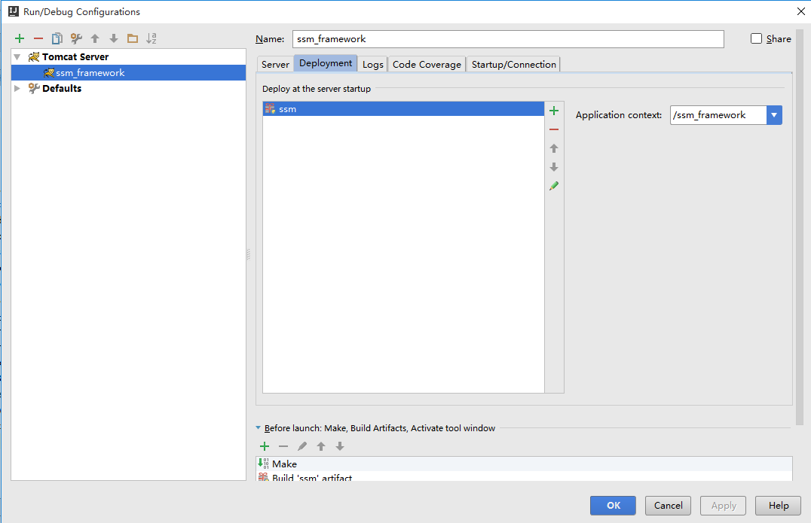

## 开发环境
- Windows 10旗舰版
- IntelliJ IDEA 2016.1旗舰版
- Java jdk_1.7.0_79
- maven 3.3.3
- MySQL 5.6

## 工程概览
### 构建maven工程
在IntelliJ IDEA中新建maven工程，File/New/Project，选择maven目录，勾选Create from archetype，选择maven-archetype-webapp类型。初次下载依赖jar包可能会耗一些时间。

工程结构目录如下所示：


### 依赖pom.xml
所有jar包依赖列举如下：
```xml
<?xml version="1.0" encoding="UTF-8"?>
<project xmlns="http://maven.apache.org/POM/4.0.0"
         xmlns:xsi="http://www.w3.org/2001/XMLSchema-instance"
         xsi:schemaLocation="http://maven.apache.org/POM/4.0.0 http://maven.apache.org/xsd/maven-4.0.0.xsd">
    <modelVersion>4.0.0</modelVersion>

    <groupId>com.inspur.learning</groupId>
    <artifactId>ssm-frame</artifactId>
    <version>1.0-SNAPSHOT</version>
    <properties>
        <!-- spring版本号 -->
        <spring.version>4.2.5.RELEASE</spring.version>
        <!-- mybatis版本号 -->
        <mybatis.version>3.4.0</mybatis.version>
        <!-- log4j日志文件管理包版本 -->
        <slf4j.version>1.7.5</slf4j.version>
        <log4j.version>1.2.17</log4j.version>
        <junit.version>4.12</junit.version>
        <mybatis-spring.version>1.3.0</mybatis-spring.version>
        <mysql-connector-java.version>5.1.39</mysql-connector-java.version>
        <fastjson.version>1.2.7</fastjson.version>
        <!--数据库连接池-->
        <commons-dbcp.version>1.4</commons-dbcp.version>
        <javaee-api.version>7.0</javaee-api.version>
    </properties>

    <dependencies>
        <dependency>
            <groupId>junit</groupId>
            <artifactId>junit</artifactId>
            <version>${junit.version}</version>
            <!-- 表示开发的时候引入，发布的时候不会加载此包 -->
            <scope>test</scope>
        </dependency>
        <!-- spring核心包 -->
        <dependency>
            <groupId>org.springframework</groupId>
            <artifactId>spring-core</artifactId>
            <version>${spring.version}</version>
        </dependency>
        <dependency>
            <groupId>org.springframework</groupId>
            <artifactId>spring-web</artifactId>
            <version>${spring.version}</version>
        </dependency>
        <dependency>
            <groupId>org.springframework</groupId>
            <artifactId>spring-oxm</artifactId>
            <version>${spring.version}</version>
        </dependency>
        <dependency>
            <groupId>org.springframework</groupId>
            <artifactId>spring-tx</artifactId>
            <version>${spring.version}</version>
        </dependency>
        <dependency>
            <groupId>org.springframework</groupId>
            <artifactId>spring-jdbc</artifactId>
            <version>${spring.version}</version>
        </dependency>
        <dependency>
            <groupId>org.springframework</groupId>
            <artifactId>spring-webmvc</artifactId>
            <version>${spring.version}</version>
        </dependency>
        <dependency>
            <groupId>org.springframework</groupId>
            <artifactId>spring-aop</artifactId>
            <version>${spring.version}</version>
        </dependency>
        <dependency>
            <groupId>org.springframework</groupId>
            <artifactId>spring-context-support</artifactId>
            <version>${spring.version}</version>
        </dependency>
        <dependency>
            <groupId>org.springframework</groupId>
            <artifactId>spring-test</artifactId>
            <version>${spring.version}</version>
        </dependency>
        <!-- mybatis核心包 -->
        <dependency>
            <groupId>org.mybatis</groupId>
            <artifactId>mybatis</artifactId>
            <version>${mybatis.version}</version>
        </dependency>
        <!-- mybatis/spring包 -->
        <dependency>
            <groupId>org.mybatis</groupId>
            <artifactId>mybatis-spring</artifactId>
            <version>${mybatis-spring.version}</version>
        </dependency>
        <!-- 导入java ee jar 包 -->
        <dependency>
            <groupId>javax</groupId>
            <artifactId>javaee-api</artifactId>
            <version>${javaee-api.version}</version>
        </dependency>
        <!-- 导入Mysql数据库链接jar包 -->
        <dependency>
            <groupId>mysql</groupId>
            <artifactId>mysql-connector-java</artifactId>
            <version>${mysql-connector-java.version}</version>
        </dependency>
        <!-- 导入dbcp的jar包，用来在applicationContext.xml中配置数据库 -->
        <dependency>
            <groupId>commons-dbcp</groupId>
            <artifactId>commons-dbcp</artifactId>
            <version>${commons-dbcp.version}</version>
        </dependency>
        <!-- 日志文件管理包 -->
        <!-- log start -->
        <dependency>
            <groupId>log4j</groupId>
            <artifactId>log4j</artifactId>
            <version>${log4j.version}</version>
        </dependency>

        <!-- 格式化对象，方便输出日志 -->
        <dependency>
            <groupId>com.alibaba</groupId>
            <artifactId>fastjson</artifactId>
            <version>${fastjson.version}</version>
        </dependency>

        <dependency>
            <groupId>org.slf4j</groupId>
            <artifactId>slf4j-api</artifactId>
            <version>${slf4j.version}</version>
        </dependency>
        <dependency>
            <groupId>org.slf4j</groupId>
            <artifactId>slf4j-log4j12</artifactId>
            <version>${slf4j.version}</version>
        </dependency>
        <!-- log end -->

    </dependencies>
<build>
   <finalName>ssm-frame</finalName>
   <resources>
     <resource>
       <directory>src/main/java</directory>
       <includes>
         <include>**/*.xml</include>
       </includes>
     </resource>
     <resource>
       <directory>src/main/resources</directory>
     </resource>
   </resources>
   <plugins>
<plugin>
   <groupId>org.apache.maven.plugins</groupId>
   <artifactId>maven-compiler-plugin</artifactId>
   <version>3.5.1</version>
   </plugin>
   <plugin>
      <groupId>org.apache.maven.plugins</groupId>
      <artifactId>maven-compiler-plugin</artifactId>
      <version>2.0.2</version>
      <configuration>
         <source>1.7</source>
         <target>1.7</target>
      </configuration>
   </plugin>
</plugins>
 </build>
</project>
```
### 数据库
在本地MySQL数据库中新建ssm_frame数据库，并执行以下user.sql文件建立相应的表和数据：
```sql
DROP TABLE IF EXISTS `user_t`;  
  
CREATE TABLE `user_t` (  
  `id` int(11) NOT NULL AUTO_INCREMENT,  
  `user_name` varchar(40) NOT NULL,  
  `password` varchar(255) NOT NULL,  
  `age` int(4) NOT NULL,  
  PRIMARY KEY (`id`)  
) ENGINE=InnoDB AUTO_INCREMENT=2 DEFAULT CHARSET=utf8;  
  
/*Data for the table `user_t` */  
  
insert  into `user_t`(`id`,`user_name`,`password`,`age`) values (1,'测试','sfasgfaf',24);
```

## Spring与MyBatis集成环境
以下是Spring与MyBatis集成环境相关配置文件和代码文件详细说明。

### 配置文件
- 数据库连接配置
在src/main/resources文件夹下建立jdbc.properties数据库配置文件，内容如下：
```
driver=com.mysql.jdbc.Driver
url=jdbc:mysql://localhost:3306/ssm_frame
username=root
password=123123
#定义初始连接数
initialSize=0
#定义最大连接数
maxActive=20
#定义最大空闲
maxIdle=20
#定义最小空闲
minIdle=1
#定义最长等待时间
maxWait=60000
```

- log4j日志配置
在src/main/resources文件夹下建立log4j.properties日志配置文件，内容如下：

```
#定义LOG输出级别
log4j.rootLogger=INFO,Console,File
#定义日志输出目的地为控制台
log4j.appender.Console=org.apache.log4j.ConsoleAppender
log4j.appender.Console.Target=System.out
#可以灵活地指定日志输出格式，下面一行是指定具体的格式
log4j.appender.Console.layout = org.apache.log4j.PatternLayout
log4j.appender.Console.layout.ConversionPattern=[%c] - %m%n

#文件大小到达指定尺寸的时候产生一个新的文件
log4j.appender.File = org.apache.log4j.RollingFileAppender
#指定输出目录
log4j.appender.File.File = logs/ssm.log
#定义文件最大大小
log4j.appender.File.MaxFileSize = 10MB
# 输出所以日志，如果换成DEBUG表示输出DEBUG以上级别日志
log4j.appender.File.Threshold = ALL
log4j.appender.File.layout = org.apache.log4j.PatternLayout
log4j.appender.File.layout.ConversionPattern =[%p] [%d{yyyy-MM-dd HH\:mm\:ss}][%c]%m%n
```

- spring与MyBatis配置文件
在src/main/resources文件夹下建立spring-mybatis.xml配置文件，内容如下：

```xml
<?xml version="1.0" encoding="UTF-8"?>
<beans xmlns="http://www.springframework.org/schema/beans"
       xmlns:xsi="http://www.w3.org/2001/XMLSchema-instance" xmlns:p="http://www.springframework.org/schema/p"
       xmlns:context="http://www.springframework.org/schema/context"
       xmlns:mvc="http://www.springframework.org/schema/mvc"
       xsi:schemaLocation="http://www.springframework.org/schema/beans
                        http://www.springframework.org/schema/beans/spring-beans-3.1.xsd
                        http://www.springframework.org/schema/context
                        http://www.springframework.org/schema/context/spring-context-3.1.xsd
                        http://www.springframework.org/schema/mvc
                        http://www.springframework.org/schema/mvc/spring-mvc-4.0.xsd">
    <!-- 自动扫描 -->
    <context:component-scan base-package="com.inspur.demo" />
    <!-- 引入配置文件 -->
    <bean id="propertyConfigurer"
          class="org.springframework.beans.factory.config.PropertyPlaceholderConfigurer">
        <property name="location" value="classpath:jdbc.properties" />
    </bean>

    <bean id="dataSource" class="org.apache.commons.dbcp.BasicDataSource"
          destroy-method="close">
        <property name="driverClassName" value="${driver}" />
        <property name="url" value="${url}" />
        <property name="username" value="${username}" />
        <property name="password" value="${password}" />
        <!-- 初始化连接大小 -->
        <property name="initialSize" value="${initialSize}"></property>
        <!-- 连接池最大数量 -->
        <property name="maxActive" value="${maxActive}"></property>
        <!-- 连接池最大空闲 -->
        <property name="maxIdle" value="${maxIdle}"></property>
        <!-- 连接池最小空闲 -->
        <property name="minIdle" value="${minIdle}"></property>
        <!-- 获取连接最大等待时间 -->
        <property name="maxWait" value="${maxWait}"></property>
    </bean>

    <!-- spring和MyBatis完美整合，不需要mybatis的配置映射文件 -->
    <bean id="sqlSessionFactory" class="org.mybatis.spring.SqlSessionFactoryBean">
        <property name="dataSource" ref="dataSource" />
        <!-- 自动扫描mapping.xml文件 -->
        <property name="mapperLocations" value="classpath:mapping/*.xml"></property>
    </bean>

    <!-- DAO接口所在包名，Spring会自动查找其下的类 -->
    <bean class="org.mybatis.spring.mapper.MapperScannerConfigurer">
        <property name="basePackage" value="com.inspur.demo.dao" />
        <property name="sqlSessionFactoryBeanName" value="sqlSessionFactory"></property>
    </bean>

    <!-- (事务管理)transaction manager, use JtaTransactionManager for global tx -->
    <bean id="transactionManager"
          class="org.springframework.jdbc.datasource.DataSourceTransactionManager">
        <property name="dataSource" ref="dataSource" />
    </bean>

</beans>
```
### 相关Java代码
- pojo模块
pojo模块定义了简单的Bean，这里只定义一个User.java类，如下：

```java
package com.inspur.demo.pojo;

/**
 * Created by LTN on 2016/7/13.
 */
public class User {
    private int userId;
    private String userName;
    private String password;
    private String age;

    public int getUserId() {
        return userId;
    }

    public void setUserId(int userId) {
        this.userId = userId;
    }

    public String getUserName() {
        return userName;
    }

    public void setUserName(String userName) {
        this.userName = userName;
    }

    public String getPassword() {
        return password;
    }

    public void setPassword(String password) {
        this.password = password;
    }

    public String getAge() {
        return age;
    }

    public void setAge(String age) {
        this.age = age;
    }
}
```

- dao层
dao层定义了基本的数据库的操作，包括接口和实现。接口定义为IUserDao.java:

```java
package com.inspur.demo.dao;

import com.inspur.demo.pojo.User;

/**
 * Created by LTN on 2016/7/13.
 */
public interface IUserDao {
    User selectByPrimaryKey(int userId);
}
```

实现类为UserMapper.xml文件，该文件放置在resources/mapping目录下。也有很多项目把该文件放在java代码的dao目录下，但是这样代码的逻辑不清晰，而且在使用maven打包时，可能会忽略在java包下的xml文件；因此推荐本文这种方式：

```xml
<?xml version="1.0" encoding="UTF-8"?>
<!DOCTYPE mapper
        PUBLIC "-//mybatis.org//DTD Mapper 3.0//EN"
        "http://mybatis.org/dtd/mybatis-3-mapper.dtd">
<mapper namespace="com.inspur.demo.dao.IUserDao">
    <resultMap id="User" type="com.inspur.demo.pojo.User">
        <id property="userId" column="id"/>
        <result property="userName" column="user_name"/>
        <result property="password" column="password"/>
        <result property="age" column="age"/>
    </resultMap>

    <select id="selectByPrimaryKey" parameterType="integer" resultMap="User">
        SELECT id,user_name,password,age
        FROM user_t
        WHERE id = #{userId}
    </select>

</mapper>
```

- 服务层
定义了IUserService.java接口：

```java
package com.inspur.demo.service;

import com.inspur.demo.pojo.User;

/**
 * Created by LTN on 2016/7/13.
 */
public interface IUserService {
        User getUserById(int userId);
}
```

以及实现类：

```java
package com.inspur.demo.service.impl;

import com.inspur.demo.dao.IUserDao;
import com.inspur.demo.pojo.User;
import com.inspur.demo.service.IUserService;
import org.springframework.stereotype.Service;

import javax.annotation.Resource;

/**
 * Created by LTN on 2016/7/13.
 */
@Service("userService")
public class UserServiceImpl implements IUserService {
    @Resource
    private IUserDao userDao;

    public User getUserById(int userId) {
        return this.userDao.selectByPrimaryKey(userId);
    }

}
```
### JUnit测试
测试代码如下：
```java
package com.inspur.demo;

import com.alibaba.fastjson.JSON;
import com.inspur.demo.pojo.User;
import com.inspur.demo.service.IUserService;
import org.apache.log4j.Logger;
import org.junit.Before;
import org.junit.Test;
import org.springframework.context.ApplicationContext;
import org.springframework.context.support.ClassPathXmlApplicationContext;

import javax.annotation.Resource;

/**
 * Created by LTN on 2016/7/13.
 */
public class TestMybatis {
    private static Logger logger = Logger.getLogger(TestMybatis.class.getName());
    private ApplicationContext ac = null;
    @Resource
    private IUserService userService = null;

    @Before
    public void before() {
        ac = new ClassPathXmlApplicationContext("spring-mybatis.xml");
        userService = (IUserService) ac.getBean("userService");
    }

    @Test
    public void test1() {
        User user = userService.getUserById(1);
        logger.info(JSON.toJSONString(user));
    }
}
```
控制台输出以下信息则说明测试成功：
```
[org.springframework.context.support.ClassPathXmlApplicationContext] - Refreshing org.springframework.context.support.ClassPathXmlApplicationContext@1730d54: startup date [Wed Jul 13 15:04:50 CST 2016]; root of context hierarchy
[org.springframework.beans.factory.xml.XmlBeanDefinitionReader] - Loading XML bean definitions from class path resource [spring-mybatis.xml]
[org.springframework.beans.factory.config.PropertyPlaceholderConfigurer] - Loading properties file from class path resource [jdbc.properties]
[com.inspur.demo.TestMybatis] - {"age":"24","password":"sfasgfaf","userId":1,"userName":"测试"}

Process finished with exit code 0
```
可在项目目录下生成的logs文件中看到ssm.log日志，具有和上述控制台相同的日志输出。

## SSM集成环境搭建
在上面Spring和MyBatis两个框架集成的基础上，再集成spring-mvc框架。
### 控制层
控制层代码如下：
```java
package com.inspur.demo.controller;

import com.inspur.demo.pojo.User;
import com.inspur.demo.service.IUserService;
import org.springframework.stereotype.Controller;
import org.springframework.ui.Model;
import org.springframework.web.bind.annotation.RequestMapping;

import javax.annotation.Resource;
import javax.servlet.http.HttpServletRequest;

/**
 * Created by LTN on 2016/7/13.
 */
@Controller
@RequestMapping("/user")
public class UserController {
    @Resource
    private IUserService userService;

    @RequestMapping("/showUser")
    public String toIndex(HttpServletRequest request, Model model){
        int userId = Integer.parseInt(request.getParameter("id"));
        User user = this.userService.getUserById(userId);
        model.addAttribute("user", user);
        return "showUser";
    }
}
```
### mvc配置文件
src/main/resources目录下，spring-mvc.xml文件配置了自动扫描使用@Controller注解的控制层代码，以及页面视图模式等，代码如下：
```xml
<?xml version="1.0" encoding="UTF-8"?>
<beans xmlns="http://www.springframework.org/schema/beans"
       xmlns:xsi="http://www.w3.org/2001/XMLSchema-instance" xmlns:p="http://www.springframework.org/schema/p"
       xmlns:context="http://www.springframework.org/schema/context"
       xmlns:mvc="http://www.springframework.org/schema/mvc"
       xsi:schemaLocation="http://www.springframework.org/schema/beans
                        http://www.springframework.org/schema/beans/spring-beans-3.1.xsd
                        http://www.springframework.org/schema/context
                        http://www.springframework.org/schema/context/spring-context-3.1.xsd
                        http://www.springframework.org/schema/mvc
                        http://www.springframework.org/schema/mvc/spring-mvc-4.0.xsd">
    <!-- 自动扫描该包，使SpringMVC认为包下用了@controller注解的类是控制器 -->
    <context:component-scan base-package="com.inspur.demo.controller" />
    
    <!-- 定义跳转的文件的前后缀 ，视图模式配置-->
    <bean class="org.springframework.web.servlet.view.InternalResourceViewResolver">
        <!-- 这里的配置我的理解是自动给后面action的方法return的字符串加上前缀和后缀，变成一个 可用的url地址 -->
        <property name="prefix" value="/WEB-INF/jsp/" />
        <property name="suffix" value=".jsp" />
    </bean>

</beans>
```

### web.xml配置
位于src/main/webapp/WEB-INF文件夹下的web.xml配置文件，引入了项目中spring-mybatis.xml的配置以及spring-mvc.xml的配置，SSM框架的集成环境搭建在这个文件中可以充分体现。
另外，该文件还指明了项目默认界面，页面为src/main/webapp/WEB-INF/index.jsp。
```xml
<?xml version="1.0" encoding="UTF-8"?>
<web-app xmlns:xsi="http://www.w3.org/2001/XMLSchema-instance"
         xmlns="http://java.sun.com/xml/ns/javaee"
         xsi:schemaLocation="http://java.sun.com/xml/ns/javaee http://java.sun.com/xml/ns/javaee/web-app_3_0.xsd"
         version="3.0">
    <display-name>Archetype Created Web Application</display-name>
    <!-- Spring和mybatis的配置文件 -->
    <context-param>
        <param-name>contextConfigLocation</param-name>
        <param-value>classpath:spring-mybatis.xml</param-value>
    </context-param>
    <!-- 编码过滤器 -->
    <filter>
        <filter-name>encodingFilter</filter-name>
        <filter-class>org.springframework.web.filter.CharacterEncodingFilter</filter-class>
        <async-supported>true</async-supported>
        <init-param>
            <param-name>encoding</param-name>
            <param-value>UTF-8</param-value>
        </init-param>
    </filter>
    <filter-mapping>
        <filter-name>encodingFilter</filter-name>
        <url-pattern>/*</url-pattern>
    </filter-mapping>
    <!-- Spring监听器 -->
    <listener>
        <listener-class>org.springframework.web.context.ContextLoaderListener</listener-class>
    </listener>
    <!-- 防止Spring内存溢出监听器 -->
    <listener>
        <listener-class>org.springframework.web.util.IntrospectorCleanupListener</listener-class>
    </listener>

    <!-- Spring MVC servlet -->
    <servlet>
        <servlet-name>SpringMVC</servlet-name>
        <servlet-class>org.springframework.web.servlet.DispatcherServlet</servlet-class>
        <init-param>
            <param-name>contextConfigLocation</param-name>
            <param-value>classpath:spring-mvc.xml</param-value>
        </init-param>
        <load-on-startup>1</load-on-startup>
        <async-supported>true</async-supported>
    </servlet>
    <servlet-mapping>
        <servlet-name>SpringMVC</servlet-name>
        <!-- 此处可以可以配置成*.do，对应struts的后缀习惯 -->
        <url-pattern>/</url-pattern>
    </servlet-mapping>
    <welcome-file-list>
        <welcome-file>/index.jsp</welcome-file>
    </welcome-file-list>

</web-app>
```
### 视图页面
src/main/webapp/WEB-INF/jsp/showUser.jsp代码如下：
```jsp
<%@ page contentType="text/html; charset=UTF-8" %>
<html>
<head>
    <title>Show User Page</title>
</head>
<body>
<h2>${user.userName} </h2>
</body>
</html>
```
### 运行测试
配置完，在浏览器访问以下路径，即可
http://localhost:8081/ssm_framework/user/showUser?id=1


## 参考资料
【1】SSM框架——详细整合教程（Spring+SpringMVC+MyBatis）
http://blog.csdn.net/zhshulin/article/details/37956105
【2】IntelliJ IDEA WEB项目的部署配置
http://my.oschina.net/lujianing/blog/186737

## 附录
IntelliJ配置web工程是一个不断尝试的过程。
在本项目配置过程中，部署的重点在File/Project Structure中Artifacts栏目的配置，要清楚最终war包的目录结构，然后在IntelliJ的Artifacts中按照目录结构构造发布目录。如项目根目录下是index.jsp、META-INF文件夹和WEB-INF，文件夹WEB-INF下为web.xml、classes文件夹、jsp文件夹和lib文件夹等等。
```sh
ssm_framework/
├── index.jsp
├── META-INF
│   └── war-tracker
└── WEB-INF
    ├── classes
    │   ├── com
    │   │   └── inspur
    │   │       └── demo
    │   │           ├── controller
    │   │           │   └── UserController.class
    │   │           ├── dao
    │   │           │   └── IUserDao.class
    │   │           ├── pojo
    │   │           │   └── User.class
    │   │           └── service
    │   │               ├── impl
    │   │               │   └── UserServiceImpl.class
    │   │               └── IUserService.class
    │   ├── jdbc.properties
    │   ├── log4j.properties
    │   ├── mapping
    │   │   └── UserMapper.xml
    │   ├── spring-mvc.xml
    │   └── spring-mybatis.xml
    ├── jsp
    │   └── showUser.jsp
    ├── lib
    │   ├── activation-1.1.jar
    │   ├── aopalliance-1.0.jar
    │   ├── commons-dbcp-1.4.jar
 xxxxxx
    │   └── spring-webmvc-4.2.5.RELEASE.jar
    └── web.xml

```
IntelliJ 一些主要配置如下图：
- File/project structure的配置


## 使用Web Application Exploded.

 
## webapp 目录内容与WEB-INF属于同级目录


- Edit Configurations的配置




